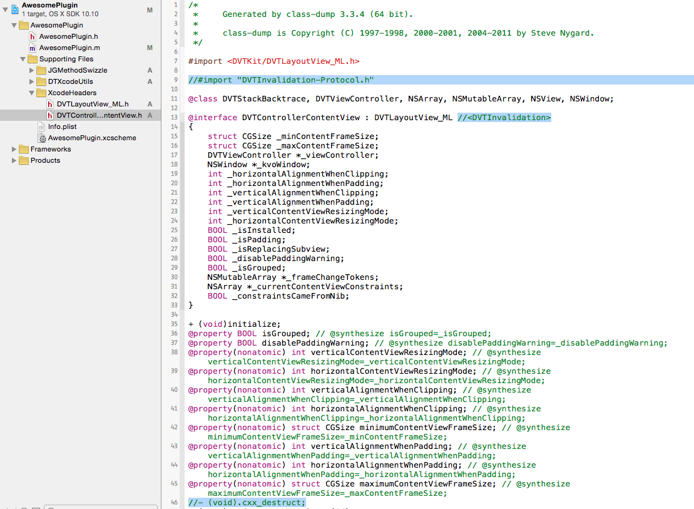
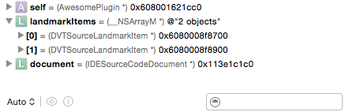

# Creating an Xcode plugin
Xcode is awesome. No doubt.  Sure, it crashes at times, frustrates us with code signing and there are certainly missing features and minor tweeks that would make it even greater.

There is a nice list of available plugins over at [NSHipster](http://nshipster.com/xcode-plugins/) that aim to help with a lot of theese.

Now here is the fun part! You, yes **YOU** can develop your own plugin and make Xcode do **anything**!

<p align="center"></p>

Remember, there is no app review process on OS X (outside of the Mac App Store) which means we can use private frameworks! 

Unfortunately there is also no official documentation on creating plugins. Members of the community, however, have scouted some of the way into Pluginland making our joruney a tad easier.

Creating an Xcore plugin feels like an adventure on an uncharted treasure island. It is a challenging trip and a great learning experience. You will never look at Xcode the same way ever again.

This tutorial will teach you how to **get started**, what **tools** to use and what **workflow** to follow when developing an Xcode plugin. 
We will create a plugin that lists the document items (interfaces, properties, methods, etc..) in the right side panel. Clicking an item will select it in the source code window and scroll to its position. It’s basically a watered down version of [ZMDocItemInspector](https://github.com/zolomatok/ZMDocItemInspector).

**Note:** This tutorial shamelessly rips off the style of those found on [raywenderlich.com](http://www.raywenderlich.com/), since they work so well. That means face memes, everybody.

## Workflow
The hardest part of the process is to find out where to begin. How do we even start developing a plugin? Lack of documentation aside, Xcode actually provides great support for plugins and internally it makes use of this feature heavily.

In order to have a greater understanding of the whole process, let me introduce you to the general **workflow**:

1. **Create a project with a plugin template** and use the initializer of the plugin as the point of insertion
2. **Browse the Xcode runtime headers** for clues on what to hook into. These headers contain the names of the protocols, properties and methods of every single class Xcode relies on
3. **Try and intercept method calls** in the target classes to replace their implementation with our own
4. **Look at the notifications Xcode broadcasts** to find out if there are broadcast events we are interested in

## Toolkit
Fortunately we can find tools for each of these tasks that will make our lives infinitly more pleasant. Time to assemble our **toolkit**!

1. Download and install **[Alcatraz](http://alcatraz.io/)**! It’s a plugin manager for Xcode which willl let us download and install the necessary plugins with the click of a button.
2. Get the following plugins via Alcatraz by going to **Window -> Package Manager** in Xcode.
 2. **“Xcode Plugin”** (on the **Templates** tab)
 2. **“XcodeExplorer”**
3. Download the **[Xcode Runtime Headers](https://github.com/zolomatok/Xcode6-RuntimeHeaders)** from GitHub.
Note, that these headers are not the real class headers. They contain every single property and method found in the original implementation files too (not just the header files)! These headers are generated by running the super fantastic class-dump command line tool on all the libraries found in /Applications/Xcode.app.
4. Get **[DTXcodeUtils](https://github.com/thurn/DTXcodeUtils)** either by downloading it from GitHub or using CocoaPods. DTXcodeUtils are just a few header files for common operations, like inspecting the current source code editor.
5. Lastly, download **[JGMethodSwizzler](https://github.com/JonasGessner/JGMethodSwizzler)**. More on method swizzling later, but this is where the magic happens.

Looking at the Xcode header files, you might notice that it is around **12,000** classes and protocols.

<p align="center"></p>

**NOTE: There seems to be a slight incompatibility between Xcode Explorer and Alcatraz.** In Xcode open the **Window** menu and see if you find the **Explorer** menu item. If it is there, no problem. If not, you can fix it the following way:

1. Download the **[Xcode Explorer](https://github.com/edwardaux/XcodeExplorer)** source from GitHub.
2. In **XCEPlugin.m** find the line *NSInteger organizerMenuItem = [[menuItem submenu] indexOfItemWithTitle:@“Organizer"];*
3. Change **@“Organizer”** to **@“Devices”**
4. Hit **build**
5. Restart Xcode
6. Voila!

***This tutorial is quite a read. To keep things organized, the rest of the article will follow the steps of the workflow described above.***

## 1: The Project
Start up Xcode 6, and go to **File \ New \ Project…** Select **Xcode Plugin**, name it **AwesomePlugin**.
<p align="center"></p>

This will create a new project with a single class which has the **name of your project**.
Let us take note of what we see in **AwesomePlugin.m** right off the bat:

1. There is a **sharedPlugin singleton**. This will come in handy during the method swizzling.
2. **-initWithBundle:** seems to be our point of insertion, and indeed there is already some code there regarding the menu

*For now, hit* ***build and run*** *and see what happens!*
<p align="center"></p>

That’s right, a new Xcode instance was opened since Xcode can debug itself! We can use all the standard debugging tools too, including breakpoints!

*Now click the* ***Edit menu***, *then the* ***Do Action*** *menu item, in the* ***newly opened Xcode instance***. Hello World!

You will find that the Do Action menu item is only available in the second Xcode. That’s because plugin loading happens when Xcode is launched. 

Since the plugin **binary is copied into the plugin directory** as part of the build process, if you quit Xcode completely and launch it again, the menu item will appear without building and running the project again.

The plugin directory for Xcode 6 is **~/Library/Application Support/Developer/Shared/Xcode/Plug-ins.** 

It is a good idea to create an **alias** for this folder somewhere that is convenient for you. If we intoruce a bug in the plugin that makes it crash (something that happens all the time) and than quit Xcode, it will keep crashing on launch time and we will not even be able to start Xcode again.

The way to solve this is by uninstalling the plugin by **deleting it from the plugin directory**, then restarting Xcode.

- - -
*Let’s setup our project.*

1, You can delete the **-doMenuAction** method, and the **“// Sample Menu Item:”** section of **-initWithBundle:**

2, Add **JGMethodSwizzler.h** and **JGMethodSwizzler.m** into your project by dragging them into the Project Navigator.

3, Add **DTXcodeHeaders.h**, **DTXcodeUtils.h** and **DTXcodeUtils.m** into the project also.

4, In **DTXcodeHeaders.h** import `AppKit` 

`#import <AppKit/AppKit.h>`

5, In **DTXcodeUtils.h** import `DTXcodeHeaders.h`

`#import "DTXcodeHeaders.h"`

<p align="center"></p>

One more **very important** part of the setup is to include the current Xcode version's UUID in the project's plist. Any plugin will only be loaded if it contains the UUID of the Xcode loading it.

To read the UUID of your Xcode, paste the following snippet into **Terminal**:

`defaults read /Applications/Xcode.app/Contents/Info DVTPlugInCompatibilityUUID`

This will spit out the unique ID you need to copy into the **Info.plist** under **DVTPluginCompatibilityUUIDS**. 

## X: Intermission
Let’s break down what is needed for us to accomplish our task. We would like to find a way to somehow…

1. **...hook into the way Xcode is building its UI** so we can inject our own views
2. ...either **gain access to the content of the editor** (the source code) OR ideally **tap into the Document Item List generation process** (the one that appears when you click the end of the breadcrumb bar above the source code) so we can just steal the whole list and not bother creating our own views
3. **...jump to a certain position** in the source code, possibly either by knowing the line number, symbol name or some other identifier
4. ... **notice when the code in the editor is changed** so we can re-generate or re-steal the content of our views

Next comes the crazy part. This is where heroes are made!

## 2: Hunting for Headers
Remember those **Xcode Runtime Headers**? Of which there are ~12,000?
We need to browse dem gud.

Fortunately the **names of the libraries are rather telling** so we can safely discard most of them. It is unlikely that we need to deal with libs like “DebuggerLLDB”, “IDESubversion” or “PhysicsKit” when we try to hook into the UI.

This is also one of two cases when **Xcode Explorer** can really help out.

*Open the* ***Window*** *menu in Xcode and click* ***Explorer \ View Clicker***.
This opens up a little window which shows us the view hierarchy when we click with the mouse.

*Click any open area on the File Inspector.*

<p align="center"></p>

This is great! With the click of the mouse we can see a lot of classes associated with the UI! Let’s find out **what libs** theses classes reside in.

There are actually two libraries that take up the building blocks of the bulk of Xcode’s UI. Can you find out which ones they are?

Go ahead, I’ll wait.

Srsly.

It’s **DVTKit** and **IDEKit**. DVTKit seems to be the lower level of the two. For the life of me, by the way, I could not figure out what DVT stands for. Interestingly, IDEKit is an open-source library which Apple has internally forked a long time ago. We do not need it for the purposes of this tutorial, but it is available on GitHub. This version is obviuosly different from the one Apple uses.

Usually what follows next is a long and arduous process of going through the class names of the libraries in question, picking out the potentially helpful ones, looking at their methods and when we find one that seems to do what we are looking for, swizzling it to check what they do.

This can and will take long hours, and indeed the bulk of the time spent developing a new plugin   will be spent on this core loop of discovery - and frustration.

Let’s jump ahead. Looking at the IDEKit classes there seems to be a rather interesting one, **IDEInspectorArea**. Not only that, but it has a method titled `-_contentViewForSlice:inCategory:`. This sure seems like the way the Inspector panel views get created!

We do not need to import the IDEInspectorArea header at this time, because we can use `NSClassFromString()` to get the class object by its name. That’s enough, since we do not plan on using any of its properties or calling any of its methods.

## 3: Swizzle time!
### 3.1 The Panel
As Mattt Thompson from NSHipster puts it, [“Method swizzling is the process of changing the implementation of an existing selector.”](http://nshipster.com/method-swizzling/)

It’s like overriding a method via subclassing, only this way the class that is doing the overriding does not have to be a subclass! It’s a language feature of Objective-C. Crazy!

1, *Import ***JGMethodSwizzler*** *in AwesomePlugin.m*

`#import “JGMethodSwizzler.h"`

2, *Next replace* ***-initWithBundle:’s*** *implementation to the following*:

```
- (id)initWithBundle:(NSBundle *)plugin {
    if (self = [super init]) {
        // reference to plugin's bundle, for resource access
        self.bundle = plugin;
        
        // Create the panel
        [self createDocPanel];
    }
    return self;
}
```

3, *Implement* ***-createDocPanel***

```
- (void)createDocPanel {
    
    // A
    Class c = NSClassFromString(@"IDEInspectorArea");
                                
    // B
    [c swizzleInstanceMethod:@selector(_contentViewForSlice:inCategory:) withReplacement:JGMethodReplacementProviderBlock {
        
        // C
        return JGMethodReplacement(id, id, id slice, id category) {
            
            // D
            id orig = JGOriginalImplementation(id, slice, category);
            return orig;
        };
    }];
}
```

Quite a lot of crazyness going on here so let’s go through each step.

**A**. `NSClassFromString` searches the runtime for the named class. This way we do not need to import anything, since we are not going to use any property on the class or call methods on it.

**B**. Swizzling `_contentViewForSlice:inCategory:` lets us look at its arguments and define our own implementation. We use id instead of concrete classes, since at this point we do not know what class each argument has. We will rely on the debugger to tell us more about that.

**C**. The **first argument** in *JGMethodReplacement* is alway **the return type** of the method being swizzled. This *can* be `void` if the method’s return type is void. 
The **second argument** is **the class** whose method we are swizzling. In this case this would be `IDEInspectorArea*` , but we can just put id as usual. 
**The remaining** is a **[variable argument list](http://www.cocoawithlove.com/2009/05/variable-argument-lists-in-cocoa.html)**, meaning an unspecified number of further arguments which are the arguments of the method being swizzled. 
You might think this is some obscure language feature, but you use it all the time. NSString’s `-stringWithFormat:` actually works the same way. 

**D**. We call the original implementation of the method so nothing will be out of order and it will seem as if nothing happened. It’s like calling super in a subclass.
**JGOriginalImplementation** works almost the same way as JGMethodReplacement with the exception of omitting the class type argument. So the first argument is the return type, then come the method arguments.

**Note:** Leaving out a method argument in JGMethodReplacement or JGOriginalImplementation or specifing the wrong return type will result in a crash. Keep in mind, that if you swizzle a method that returns `void`, you must specify void as the return type during swizzling, and delete the return statement of JGMethodReplacement. In other words the swizzling would look like this:

```
[c swizzleInstanceMethod:@selector(_contentViewForSlice:inCategory:) withReplacement:JGMethodReplacementProviderBlock {
    
    return JGMethodReplacement(void, id, id slice, id category) {
        JGOriginalImplementation(void, slice, category);
    };
}];
```

Do **not** do this now, however.


- - -


*Put a* ***breakpoint*** *on the `return orig;` line, then* ***build and run!***

Xcode will complain about `_contentViewForSlice:inCategory:` being an `undeclared selector`, but you can safely disregard the warning. In fact you can silence it with statement for the compiler. See this [StackOverflow](http://stackoverflow.com/questions/6224976/how-to-get-rid-of-the-undeclared-selector-warning) question.

<p align="center"></p>

Alright seems like slice is of type `IDEUtilitySliceExtension*`, while category is of type `DVTExtension*`, and apparently the method’s return type is `DVTControllerContentView*`.

Looking at their header files it seems both sport the `name` property, which might reveal more about them.

*Insert the following line just before ‘// D’:*

`NSLog(@"Slice name: %@ || Category name: %@",[slice name], [category name]);`

*Let’s* ***build and run*** *again.*

Now we are getting somewhere! Seems like the name of the slice really tells us which view is being created.

Switching between the inspector tabs, there is a slice named **“QuickHelpInspectorMain”**. Ideally, with more time, we could find the method that inserts these slices and create our own tab in the inspector tab switcher, but since the Quick Help inspector is rarely used, we can hijack it to display our views.

- - -
First we need to import `DVTControllerContentView.h` into our project. It is a subclass of `DVTLayoutView_ML` so we need to import him too. DVTLayoutView_ML is just an NSView subclass, so the chain of imports stops here, but it is not uncommon having to import numerous files so that you can use one class.

*Let’s create a New Group titled XcodeHeaders for our imported headers in the Project Navigator and drag ’n’ drop* ***DVTControllerContentView.h*** *and* ***DVTLayoutView_ML.h*** *into it. Check “Copy items if needed”. To find them, open the runtime headers folder in Finder and search for their names.*

After importing the headers, there are a couple of things we need to do:

1. The class-dumping process inserts a `- (void).cxx_destruct;` method declaration into each file. Since these are not valid Obj-c method names, Xcode will complain. **Just comment it out or delete it**.
2. The headers do not contain the necessary `#imports`, we have to do them manually
  2. Import the **superclass** if it's not a Foundation or AppKit class
  2. Other unknown classes need not necessarily be imported. We can substitute the imports with simple `@class` declarations. 
3. The class might have **protocol conformances** declared. Comment them out, or delete them.

<p align="center"></p>

- - -

*Now that we have the necessary classes in our project, let's import `DVTControllerContentView.h` in `AwesomePlugin.m`*

```
#import "DVTControllerContentView.h"
```

*Then let’s declare a* ***global property*** *of type `NSView`* in `AwesomePlugin.m`, called **“containerView”**. So our `@interface` looks like this:*

```
@interface AwesomePlugin()
@property NSView *containerView;
@property (nonatomic, strong, readwrite) NSBundle *bundle;
@end
```

*Now change the `-createDocPanel` implementation to the following:*

```
- (void)createDocPanel {

    Class d = NSClassFromString(@"IDEInspectorArea");
    [d swizzleInstanceMethod:@selector(_contentViewForSlice:inCategory:) withReplacement:JGMethodReplacementProviderBlock {
        return JGMethodReplacement(id, id, id slice, id category) {
            
            DVTControllerContentView *orig = JGOriginalImplementation(DVTControllerContentView *, slice, category);

			// A
            if ([[slice name] isEqualToString:@"QuickHelpInspectorMain"]) {
               
				// B 
                // Create the container
                sharedPlugin.containerView = [[NSView alloc] initWithFrame:CGRectMake(0, 0, orig.frame.size.width, 400)];
                [sharedPlugin.containerView setWantsLayer:YES];
                [sharedPlugin.containerView.layer setBackgroundColor:[[NSColor clearColor] CGColor]];
                
				// C
                // Update the items
                [sharedPlugin updatePanel];
                
                
				// D
                // Push the container
                [orig setContentView:sharedPlugin.containerView];
            }
            
            
            return orig;
        };
    }];
}
```

*Finally, implement `-updatePanel:`*

```
- (void)updatePanel {
    
    NSTextField *textField = [[NSTextField alloc] initWithFrame:CGRectMake(0, 400-30, sharedPlugin.containerView.frame.size.width, 30)];
    textField.selectable = NO;
    textField.editable = NO;
    textField.bezeled = NO;
    textField.drawsBackground = NO;
    textField.font = [NSFont systemFontOfSize:13];
    [textField setLineBreakMode:NSLineBreakByTruncatingTail];
    textField.stringValue = @"Hello World";
    [sharedPlugin.containerView addSubview:textField];
}
```

As usual, let’s look at what we just did:

**A**. We check if the currently handled slice is the **Quick Help**.

**B**. Since we will need to add multiple views in the panel, we create a container view to simplify things. Our container view is a **global variable** since we will need to access it every time we want to change the contents of the panel (when a save happens in the code for example). 
Remember, we are inside the **JGMethodReplacement** function, so `self` would actually refer to the object whose method we are swizzling. That means `self.containerView` would throw an `unknown selector` error. This is where `sharedPlugin` comes handy.

**C**. Since we will need to make changes to the contents of the panel, it’s best to separate the view population into a separate method. On OS X the origin is at the lower left corner, that is why we need to subtract the height of our view from the overall height to make our label appear on top. See this [StackOverflow](http://stackoverflow.com/questions/12408334/cocoa-nsview-origin-x-at-the-bottom) question if you cannot live with the way things are.

**D**. I am cheating here a bit, since we wouldn’t actually know this yet, but DVTControllerContentView can only have one subview and that is set via `-setContentView:`. If we tried to call `-addSubview:` the plugin would crash and inform us about this problem.

*Let’s* ***build and run!***

<p align="center"></p>

### 3.2 The Editor 
Now that we know how to **display** our own content within Xcode, it’s time to actually retrieve the information we need. That means interpreting the code!

Fortunately we do not have to parse C, Obj-C or Swift code ourselves. Xcode parses it as you type, so by the time we need to look at the code it is conveniently parsed and objectified! 

This happens on multiple levels. If you need to access the **symbol** tree take a look at at the [CodePilot](https://github.com/macoscope/CodePilot) plugin’s code, since its creators, the wonderful people that they are open-sourced it. If you are interested in a history lesson you should definitely read [The Story of Code Pilot](http://macoscope.com/blog/the-story-of-code-pilot/)!

However, we will deal with an abstraction layer that has more to do with the way the editor displays the code, than the code itself. The **Document Landmark Items**. This is where **DTXcodeUtils** comes into play. It is a collection of known DVTKit and IDEKit classes that has something to do with the code editor. 
Note, that DTXCodeUtils does not actually contain the header of these cslasses, it just declares them along with a few helpful methods and properties they have. If we want the full picture on what these classes do, we have to find them among the runtime headers and look at them wholly.

DTXcodeUtils surfaces a class called DVTSourceCodeEditor which seems like something we night meed. And sure enought, upon closer inspection we find that it has a method called `-ideTopLevelStructureObjects` which returns someting. Let’s find out what it is!

1, *Import AppKit into into* ***DTXcodeHeaders.h*** *to silence the compiler errors*

`#import <Appkit/AppKit.h>`

2, *Import DTXcodeHeaders in* ***DTXcodeUtils.h***

`#import “DTXcodeHeaders.h"`

3, *Since we know IDESourceCodeDocument has a method called `-ideTopLevelStructureObjects` let’s make it known to the compiler. Add the method into the @interface declaration of IDESourceCodeDocument in* ***DTXcodeHeaders.h*** *so it looks like the following:*

```
@interface IDESourceCodeDocument : IDEEditorDocument
- (NSArray *)ideTopLevelStructureObjects;
@end
```

4, *Import DTXCodeUtils in* ***“AwesomePlugin.m”***

`#import "DTXcodeUtils.h"`

5, *Change the `-updatePanel` implementation to the following:*

```
- (void)updatePanel {
    IDESourceCodeDocument *document = [DTXcodeUtils currentSourceCodeDocument];
    id landmarkItems = [document ideTopLevelStructureObjects];
}
```

6, *Insert a breakpoint after the `id landmarkItems =…;` line.*

7, ***Build and run!***

- - -

<p align="center"></p>

Alright, apparently `-ideTopLevelStructureObjects` returns an NSArray* containing **DVTSourceLandmarkItems**.

And surprise, surprise right clicking on the **landmarkitems** array and selecting **“Print Description of “landmarkitems”** prints some very interesting things! We can see all the interface and implementation elements along with what seems to be their position in the document. This is very promising! Indeed if we have `#pragma`s in our code, it prints those too!

Seems like all we have to do is retrieve the landmark items and display them! Seems easy enough.

1, *Drag ’n’ Drop DVTSourceLandmarkItem.h from the runtime headers into the project navigator. Make sure you delete the unnecessary protocol conformances and the .cxx method.*

2, *Import DVTSourceLandmarkItem into* ***AwesomePlugin.m***

`#import "DVTSourceLandmarkItem.h"`

3, *Declare a global variable of type NSMutableArray * in* ***AwesomePlugin.m*** *called currentItems*

`@property NSMutableArray *currentItems;`

4, *Change the `-updatePanel` implementation to the following:*

```
- (void)updatePanel {
    
    IDESourceCodeDocument *document = [DTXcodeUtils currentSourceCodeDocument];
    NSArray *landmarkItems = [document ideTopLevelStructureObjects];
    
    // Let’s flatten the array, so it’s easier to work with
    self.currentItems = [NSMutableArray array];
    for (DVTSourceLandmarkItem *item in landmarkItems) {
        NSMutableArray *items = [self childrenFromLandmarkItem:item];
        [self.currentItems addObjectsFromArray:items];
    }
    
    // Display the items
    [self populatePanel];
}
```

5, *Implement `-childrenFromLandmarkItem`*

```
- (NSMutableArray *)childrenFromLandmarkItem:(DVTSourceLandmarkItem *)landmarkItem {
    
    NSMutableArray *returnArray = [NSMutableArray array];
    [returnArray addObject:landmarkItem];
    for (DVTSourceLandmarkItem *child in landmarkItem.children) {
        [returnArray addObjectsFromArray:[self childrenFromLandmarkItem:child]];
    }
    
    return returnArray;
}
```

There. One more thing left to do which is to implement `-populatePanel`. But before we can do that, we need to implement an NSTextField subclass to capture mouse clicks.

This is because later on we would like to have the feature of jumping to the source code position of the method signiter being clicked.

6, *Create new file, name it APTextField and make it a subclass of NSTextField. Then replace the contents of `APTextField.h` with the following...*

```
#import <Cocoa/Cocoa.h>

@protocol APTextFieldClickDelegate <NSObject>
- (void)itemViewWithTagDidReceiveClick:(NSInteger)tag;
@end

@interface APTextField : NSTextField
@property (weak) id <APTextFieldClickDelegate> clickDelegate;
@end
```

...while `APTextField.m` should look like this:

```
#import "APTextField.h"
@interface APTextField ()
@property NSTrackingArea *areaTracker;
@end

@implementation APTextField

- (instancetype)initWithFrame:(NSRect)frameRect {
    self = [super initWithFrame:frameRect];
    
    return self;
}


- (void)mouseUp:(NSEvent *)theEvent {
    [NSAnimationContext runAnimationGroup:^(NSAnimationContext *context) {
        context.duration = 0.05;
        self.animator.alphaValue = 0;
    } completionHandler:^{
        [NSAnimationContext runAnimationGroup:^(NSAnimationContext *context) {
            context.duration = 0.05;
            self.animator.alphaValue = 1;
        } completionHandler:nil];
    }];
        if ([self.clickDelegate respondsToSelector:@selector(itemViewWithTagDidReceiveClick:)]) {
        	[self.clickDelegate itemViewWithTagDidReceiveClick:self.tag];
    }
}


-(void)updateTrackingAreas {
    if (self.areaTracker != nil) {
        [self removeTrackingArea:self.areaTracker];
    }
    
    int opts = (NSTrackingMouseEnteredAndExited | NSTrackingActiveAlways);
    self.areaTracker = [ [NSTrackingArea alloc] initWithRect:[self bounds]
                                                     options:opts
                                                       owner:self
                                                    userInfo:nil];
    [self addTrackingArea:self.areaTracker];
}
@end
```

Nothing really fancy here, just making sure that when we click the textfield the clickDelegate is informed along with its tag.

7, *Import `APTextField.h` in* ***AwesomePlugin.m***

`#import "APTextField.h"`

8, *Now we can move on and implement `-populatePanel:`*

```
- (void)populatePanel {
    
    // Remove the previous views
    [sharedPlugin.containerView setSubviews:[NSArray array]];
    
    
    // Calculate and set the height of the container view
    float itemHeight = 20;
    float correctHeight = self.currentItems.count*itemHeight+itemHeight*1.5;
    [sharedPlugin.containerView setFrame:CGRectMake(sharedPlugin.containerView.frame.origin.x, sharedPlugin.containerView.frame.origin.y, sharedPlugin.containerView.frame.size.width, correctHeight)];
    
    
    // Add the current items
    for (int i = 0; i < self.currentItems.count; i++) {
        
        DVTSourceLandmarkItem *item = self.currentItems[i];
        if (!item.name || [item.name isKindOfClass:[NSNull class]]) {
            continue;
        }
        
        float itemY = sharedPlugin.containerView.frame.size.height-itemHeight*1.5-(i*itemHeight);
        APTextField *textField = [[APTextField alloc] initWithFrame:CGRectMake(20, itemY, sharedPlugin.containerView.frame.size.width, itemHeight)];
        textField.selectable = NO;
        textField.editable = NO;
        textField.bezeled = NO;
        textField.drawsBackground = NO;
        textField.font = [NSFont systemFontOfSize:13];
        [textField setLineBreakMode:NSLineBreakByTruncatingTail];
        textField.stringValue = item.name;
        [textField setTag:i];
        textField.clickDelegate = self;
        [sharedPlugin.containerView addSubview:textField];
    }
}
```

**And we are done!**

I’ll let this music illustrate the epicness of what we have accomplished so far:
https://www.youtube.com/watch?v=VAZsf8mTfyk

### 3.3 Jumping around

Now we just need to find out how we can manipulate the editor to **scroll to the document item** we click on in the panel and **select it automatically**.

Since DTXcodeUtils was specifically created to help with this sort of stuff, let’s have a look around there.

Sure enough, seems like there is **IDESourceCodeEditor** which quite possibly represents the main editor area. Inspecting the whole class in the runtime headers folder it evidently sports a `-selectDocumentLocations:highlightSelection:` method! We should investigate.

*Let’s declare the `-selectDocumentLocations:highlightSelection:` method in* ***DTXcodeHeaders.h*** *in* ***IDESourceCodeEditor’s*** *`@interface`, so it looks like this:*

```
@interface IDESourceCodeEditor : IDEEditor
@property(readonly) IDESourceCodeDocument *sourceCodeDocument;
@property(retain) DVTSourceTextView *textView;
- (void)selectDocumentLocations:(id)locations highlightSelection:(BOOL)highlightSelection;
@end
```

*Make `AwesomePlugin` conform to `APTextFieldClickDelegate`*

`@interface AwesomePlugin() <APTextFieldClickDelegate>`

*Implement the `-itemViewWithTagDidReceiveClick:` delegate method we created previously in* ***AwesomePlugin.m***

```
- (void)itemViewWithTagDidReceiveClick:(NSInteger)tag {
    IDESourceCodeEditor *editor = (IDESourceCodeEditor *)[DTXcodeUtils currentEditor];
    [editor selectDocumentLocations:@[@0] highlightSelection:NO];
}
```

Nothing crazy right now, we just ask for the editor from DTXcodeUtils and call our newly discovered method on it.

Even if we (most likely) get a crash, I’m hoping we will be able to tell what input `-selectDocumentLocations:` requires from the error log (**Xcode is pretty verbose in its error messages** which really helps!). We are betting on the `highlightSelection:` part to require a BOOL, since it most likely does.

***Build and run*** *then click one of the items in the panel!*

- - -

**WOAH. Big huge crash.** But let’s look at the log. There it is: 

`Details:  location should be an instance inheriting from DVTDocumentLocation, but it is <__NSCFNumber: 0x27>`

Alright, let’s use a **DVTDocumentLocation**, whatever it is.

*About an our of frustration follows as we struggle to make the damn selection work, while in the end we realize that the error message was really hyper specific. We need to use an `instance inheriting from DVTDocumentLocation` not an instance of DVTDocumentLocation. What we actually have to use is* ***DVTTextDocumentLocation.***

1, *Drag ’n’ drop the* ***DVTDocumentLocation.h*** *and* ***DVTTextDocumentLocation.h*** *into our project and clean up the imports as described previously.*

2, *Import DVTTextDocumentLocation.h in* ***AwesomePlugin.m***

3, Change the implementation of `-itemViewWithTagDidReceiveClick:` to the following:

```
- (void)itemViewWithTagDidReceiveClick:(NSInteger)tag {
    [self jumpToLandmarkItemInTheEditor:self.currentItems[tag]];
}
```

4, Implement `-jumpToLandmarkItemInTheEditor:`

```
- (void)jumpToLandmarkItemInTheEditor:(DVTSourceLandmarkItem *)landmarkItem {
    
    // Check if the current editor is a source code editor (not IB or quick look, etc)
    IDESourceCodeEditor *editor = (IDESourceCodeEditor *)[DTXcodeUtils currentEditor];
    if (![editor isKindOfClass:[NSClassFromString(@"IDESourceCodeEditor") class]]) {
        return;
    }
    
    
    // Jump to the item's location in the source code
    IDESourceCodeDocument *scd = [DTXcodeUtils currentSourceCodeDocument];
    DVTTextDocumentLocation *highlightLocation = [[NSClassFromString(@"DVTTextDocumentLocation") alloc] initWithDocumentURL:scd.fileURL timestamp:[NSNumber numberWithDouble:landmarkItem.timestamp] characterRange:landmarkItem.nameRange];
    [editor selectDocumentLocations:@[highlightLocation] highlightSelection:NO];
}
```

Alright then. What we just did is check whether the current editor is indeed a source code editor and than initialize a **DVTTextDocumentLocation** object with the document url of the currently edited file, the **timestamp** and **name range** of the landmark item.

If you think about it, using the timestamp for the identifier of a document item is really quite a genius solution from the maker of DVTKit.

Also, we use `[NSClassFromString(@“DVTTextDocumentLocation”) alloc]`, not `[DVTTextDocumentLocation alloc]`, beacuse the latter would cause an Undefined symbol linker error. I honestly have  no idea why.

***Build and run!***

**Hey, look at that!**
Not only is the selection working flawlessly, it automagically scrolls the editor to the right position too! **Great!**

## 4: Saving grace

We are in the finish line! The only thing left to do is to somehow learn when the users saves the code, so we can rescan the docuent items.

Liiiiike, and **NSNotification** would be nice….

Time to break out Xcode Explorer again. It has a nice **Notifications view** which displays every single notification Xcode fires, real-time.

1. *Goto* ***Window*** *menu* ***Explorer \ Notifications***
2. *Press the big circular record button in the Notifications window.*
3. *Press Command-S.*
4. **Rejoice!** IDEEditorDocumentDidSaveNotification and IDESourceCodeEditorDidFinishSetup!

Hurry, before it escapes!

1, *Add the following line in the `-initWithBundle:` method, just after `[self createDocPanel`]*

```
// Notifications
[[NSNotificationCenter defaultCenter] addObserver:self selector:@selector(notificationListener:) name:nil object:nil];
```

2, *Implement `-notificationListener:`*

```
- (void)notificationListener:(NSNotification *)notif {
    
    // Save or File changed
    if ([notif.name isEqualToString:@"IDEEditorDocumentDidSaveNotification"] || [notif.name isEqualToString:@"IDESourceCodeEditorDidFinishSetup"]) {
       [sharedPlugin updatePanel];
    }
}
```


***Build and run!*** Create a new method, hit save and whatch the panel repopulate! It also works when switching between files!

<p align="center"></p>

## Distribution

When you are done with your plugin it's best to include it in Alcatraz! Fork the [Alcatraz package repository](https://github.com/supermarin/alcatraz-packages) and include your github link.

**Don't forget: Every time a new Xcode comes out (even if it's from say Xcode 6.2 to 6.3) its UUID will change. Make sure you update your plugin with the new UUID, else your plugin will stop working for everyone.**

## Where to go from here?

You can take a look at the source code of [ZMDocItemInspector](https://github.com/zolomatok/ZMDocItemInspector) which is a beefed up version of AwesomePlugin. 

When you start using your shiny new plugin and start to notice that Xcode crashes more often than it usually does, open the Console.app in your Applications / Utilities folder. The log there contains a line about Xcode having crashed and there is a button which will let you see the crash report.

It is a good idea to use @try-catch in your plugin until you are absolutely certain that the plugin is crash-free. Else anyone using your work will be :( and frustrated. 

I must thank [Craig Edwards](https://github.com/edwardaux) the creator of Xcode Explorer, [Derek Thurn](https://github.com/thurn) compiler of DTXcodeUtils, [Jonas Gessner](https://github.com/JonasGessner) the creator of JGMethodSwizzler, the guys begind [CodePilot](https://github.com/macoscope) like Zbigniew Sobiecki and every one of the people making Xcode plugins and publishing them on GitHub so we can all learn from them!

This tutorial could not have happened without them.

The sites I learned from:

http://www.overacker.me/blog/2015/01/25/creating-an-xcode-plugin

http://artsy.github.io/blog/2014/06/17/building-the-xcode-plugin-snapshots/

http://nshipster.com/xcode-plugins/

http://www.fantageek.com/1297/how-to-create-xcode-plugin/

and the CodePilot source: https://github.com/macoscope/CodePilot

Thank you all.

